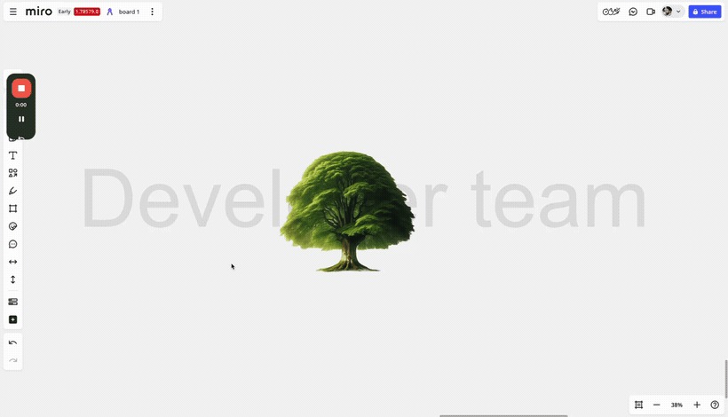
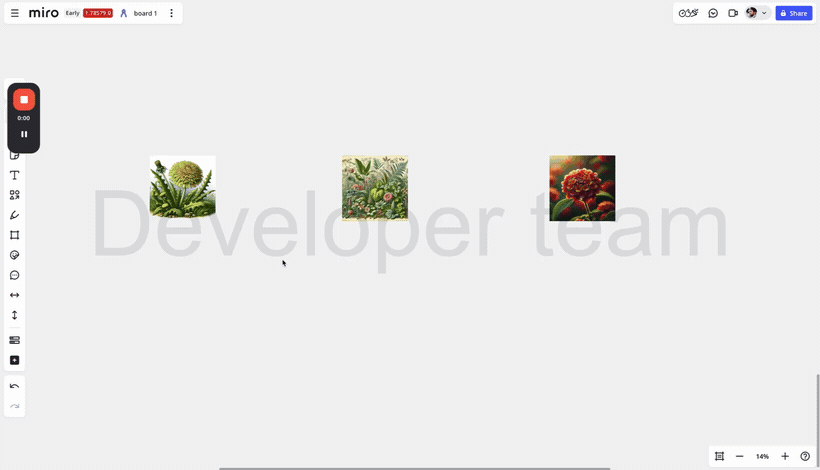

# Image Flip for Miro

Mirror any image on a Miro board in one click — horizontally or vertically — without leaving the canvas.

Select one or more images, click the app icon in the board toolbar, and a flipped copy appears next to each original. Your originals are never modified.

It ships as **two separate one-click apps** — *Horizontal Flip* and *Vertical Flip* — so each gets its own toolbar icon and each flip is a single click, with no panel to open.

> [!IMPORTANT]
> **This is a personal side project, not a Miro product.** It's built and maintained by an individual, and is not made, reviewed, endorsed or supported by Miro. It comes with no warranty and no guarantee that it will keep working. Miro Support can't help with it — please [open an issue](https://github.com/CharlieWinters/miro-image-flip/issues) instead.

---

## Install

| App | What it does | Install |
| --- | --- | --- |
| **Horizontal Flip** | Mirrors left ↔ right, places the copy to the right of the original | [Install Horizontal Flip](https://miro.com/app-install/?response_type=code&client_id=3458764683764683804&redirect_uri=%2Fapp-install%2Fconfirm%2F) |
| **Vertical Flip** | Mirrors top ↔ bottom, places the copy below the original | [Install Vertical Flip](https://miro.com/app-install/?response_type=code&client_id=3458764683769120268&redirect_uri=%2Fapp-install%2Fconfirm%2F) |

Install either or both. After installing, open a board and look for the icon in the left-hand toolbar (under **Apps** if the toolbar is collapsed). Installing requires permission to read and write board content — the app only touches the images you have selected.

These are unlisted developer apps published by an individual, not Marketplace apps vetted by Miro, so Miro's install screen will flag them as such. Read the source in this repo before installing, and check with your Miro admin if your team restricts third-party apps.

---

## How to use

1. Select one or more images on the board.
2. Click **Horizontal Flip** or **Vertical Flip** in the toolbar.
3. A mirrored copy of each selected image is added to the board, 20 px from the original.

If nothing (or nothing image-shaped) is selected, the app shows a *"Please select at least one image to flip"* notification and does nothing else. Non-image items in your selection are ignored, so you can lasso freely.

### One image, both directions

The horizontal copy lands to the right, the vertical copy lands below.



### Multiple images at once

Select as many images as you like — each one gets its own flipped copy.



---

## How it works

- Reads the selected items via the Miro Web SDK (`miro.board.getSelection()`) and keeps only items of type `image`.
- Pulls each image's pixels with `image.getDataUrl()` and mirrors them on an HTML `<canvas>` (`ctx.scale(-1, 1)` for horizontal, `ctx.scale(1, -1)` for vertical).
- Adds the result back with `miro.board.createImage()`, matching the original's width so the aspect ratio is preserved.

Everything happens in your browser. There is no backend and no third-party service — the only place the flipped image is sent is the board it came from.

**Good to know:** flipped copies are written as PNGs, so a flipped JPEG comes back larger on disk than the original. Very large images take a moment to process, since the flip runs on the main thread, one image at a time.

---

## Local development

Requires Node.js 16+.

```bash
npm install
npm start          # dev server on http://localhost:3000
```

Then point an app at it in the [Developer Dashboard](https://developers.miro.com/docs/build-your-first-hello-world-app#step-3-configure-your-app-in-miro):

| App | **App URL** for local dev |
| --- | --- |
| Horizontal Flip | `http://localhost:3000/horizontal.html` |
| Vertical Flip | `http://localhost:3000/vertical.html` |

Open a board on the same account and the app appears in the toolbar.

> **Note:** use a Chromium-based browser for local development. Safari enforces HTTPS and won't load `localhost` over HTTP.

## Build and deploy

```bash
npm run build      # static output in dist/
```

Deployment is automatic: [`.github/workflows/deploy.yml`](./.github/workflows/deploy.yml) builds the app and publishes it to GitHub Pages on every push to `main`. Pull requests run the same build as a check, so a build that can't produce working entry points never reaches `main`. You can also trigger a deploy by hand from the **Actions** tab, and roll back to any earlier deploy from the **Environments** tab.

The published apps run on GitHub Pages:

- `https://charliewinters.github.io/miro-image-flip/horizontal.html`
- `https://charliewinters.github.io/miro-image-flip/vertical.html`

Those are the **App URL** values set on the two apps above. They never change, so a redeploy reaches everyone who has the app installed — no reinstall, and no staging step either. Expect up to ten minutes before a change is live for a given user, since GitHub Pages serves these files with `cache-control: max-age=600`.

That cache window is also why the build emits **unhashed asset filenames** (see [`vite.config.js`](./vite.config.js)). Each deploy replaces the contents of the site; with hashed names, a browser holding a cached HTML entry point would request a JavaScript file the new deploy had just deleted, 404, and leave the toolbar button silently doing nothing. Stable names always resolve — at worst a user briefly gets the previous build.

If you fork this repo, update `base` in [`vite.config.js`](./vite.config.js) to match your own repository name, set your fork's Pages URLs as the App URLs, and set **Settings → Pages → Source** to **GitHub Actions**.

## Project structure

```
.
├── horizontal.html    // App URL for Horizontal Flip
├── vertical.html      // App URL for Vertical Flip
├── index.html         // local dev landing page
├── app.html           // panel variant with both buttons (not used by the installed apps)
├── .github/workflows
│  └── deploy.yml      // builds and publishes to GitHub Pages on push to main
├── src
│  ├── horizontal.js   // horizontal flip, runs on icon:click
│  ├── vertical.js     // vertical flip, runs on icon:click
│  ├── app.js          // panel variant logic
│  ├── index.js        // opens the panel variant
│  └── assets
└── vite.config.js     // picks up every .html in the root as a build entry
```

`horizontal.html` / `vertical.html` are the two shipped apps. `index.html`, `app.html` and `src/app.js` are the panel-based variant kept from the original scaffold — handy if you'd rather have one app with two buttons instead of two toolbar icons.

## Built with

[`create-miro-app`](https://www.npmjs.com/package/create-miro-app), the [Miro Web SDK v2](https://developers.miro.com/docs/web-sdk-reference), [Mirotone](https://www.mirotone.xyz/) and [Vite](https://vitejs.dev/).

Publishing to the Miro Marketplace: see [`APP_SUBMISSION.md`](./APP_SUBMISSION.md) and the [submission docs](https://developers.miro.com/docs/submit-your-app).

## License and affiliation

MIT.

Miro is a trademark of Miro (RealtimeBoard Inc. dba Miro). This project is an independent, unofficial app built on Miro's public Web SDK and is not affiliated with, authorised by, or sponsored by Miro.
